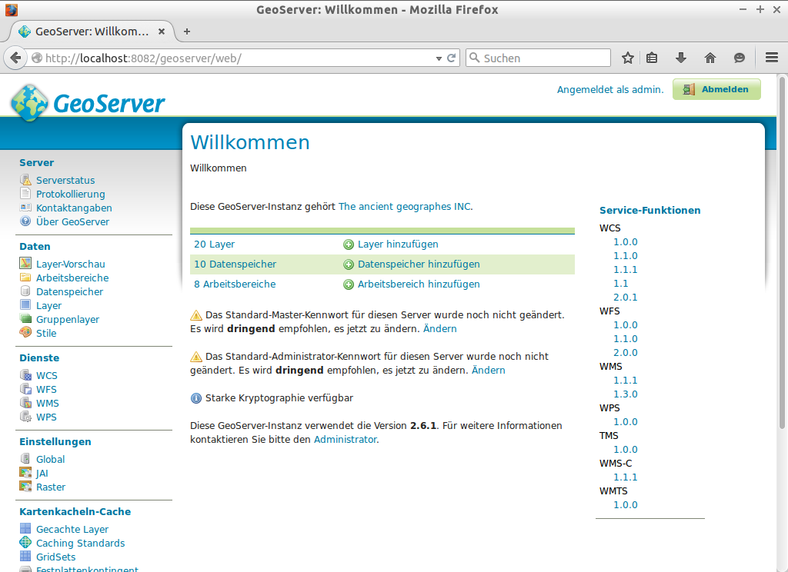

# Basic knowledge about GeoServer

[GeoServer](http://geoserver.org/) is an open, Java-based server,
which allows to display and edit geodata based on the standards of the [Open Geospatial Consortium (OGC)](https://www.opengeospatial.org/)
(in particular WMS and WFS). A strength of GeoServer is its flexibility with which it can be extended by additional functionality.

GeoServer is well documented. The documentation is divided into a user-documentation and a developer-documentation:

* User-documentation: [https://docs.geoserver.org/stable/en/user/](https://docs.geoserver.org/stable/en/user/)
* Developer-documentation: [https://docs.geoserver.org/stable/en/developer/](https://docs.geoserver.org/stable/en/developer/)

The two links refer to the documentation of the last stable version.
The *stable* in the respective URL can also be replaced by a version number, if you want to access the documentation of a specific GeoServer version. Within this workshop **Version {{ book.geoServerVersion }}** is used, so the resulting URL for the user-documentation is <https://docs.geoserver.org/{{ book.geoServerVersion }}/user/>.

Usually, GeoServer is provided for productive operation as a (Java-)standalone servlet in the form of a `.war` - file, which can be downloaded from <http://geoserver.org/download/>.
The `.war` - file must then be published (often called *deploy*) to a
servlet container (for example [Tomcat](https://tomcat.apache.org/) or
[Jetty](https://eclipse.org/jetty/)) afterwards. The web interface of GeoServer can then be called from the browser.

<!--hier auf einmal deutsches bild-->

Further information and details about a classic WAR-installation you can find
[here](https://docs.geoserver.org/stable/en/user/installation/war.html).

> **note**
>
> GeoServer is already pre-installed on the OSGeoLive system
> and can be accessed during the workshop at   {{ book.geoServerBaseUrl }} 
> (see [here](../environment/README.md)). This variant differs from the classical *deployment* as a .war file, since a Java program 
> (start.jar) is executed, which programmatically  starts a Jetty-server with
> Geoserver. This is not important for the contents of the workshop.

In [the following](../ui/index.html) section we will first get an overview of the GeoServer folder structure. Afterwards it is explained how GeoServer extensions can be installed. 
In the conclusion of the module, it is mentioned how the source code of GeoServer (or individual extensions) can be compiled with the 
*Build-Management-Tool* Maven.
