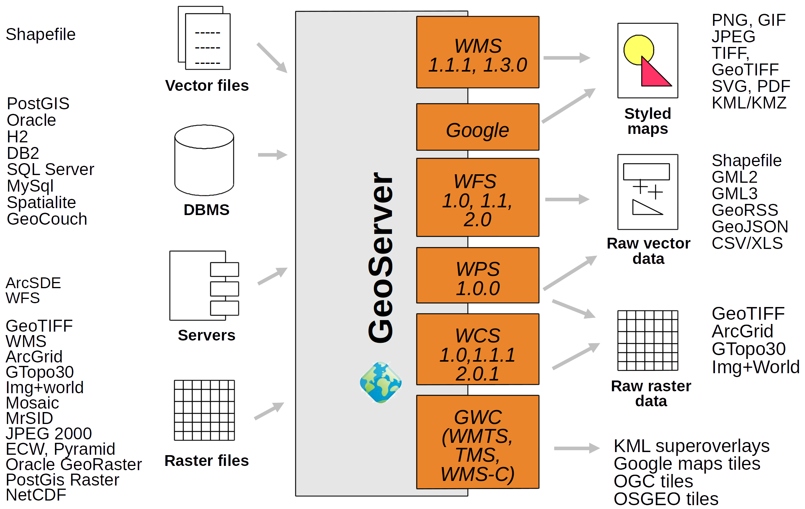

# Data publishing

Geodata can be available in raster and vector format. These two formats differ in the way spatial information is stored. While vector data displays the information via mathematical vertices and paths, for example a sequence of x,y coordinates for a line feature, raster data stores its information in cells.
Depending on the scale and application, it is recommended to use one or the other format for the visualization of the geodata. The following graphic shows an overview of the possible input and output formats of GeoServer.

In [the following](./vector/index.html), the publication of layers from a vector data source is explained first.
