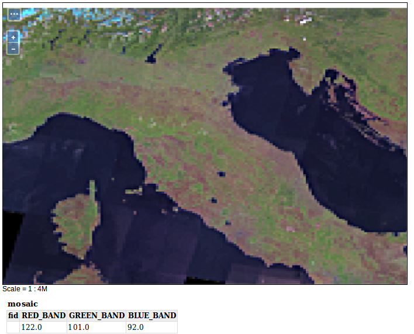
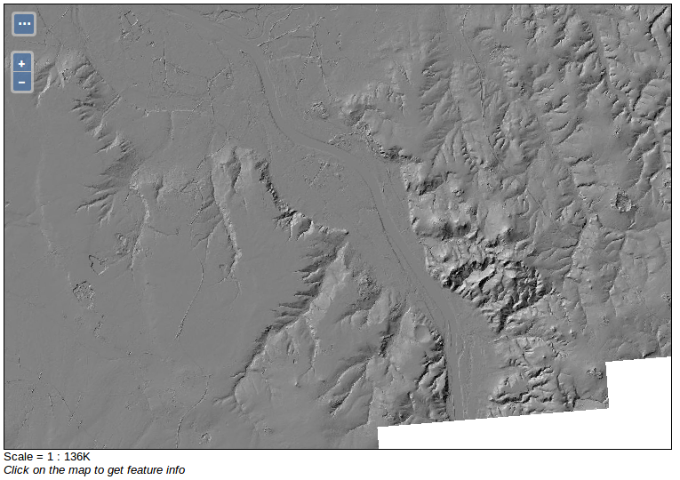

# Raster data sources

## GeoTIFF

**Task:**

GeoTIFF is a common raster data format, as it is well suited for processing geodata due to its lossless storage. In addition to the TIFF image format, GeoTIFF contains coordinates for georeferencing and information about the used map projection.

1. Create a new data store, which can be used to publish a GeoTIFF via GeoServer. Use `data/sf/sfdem.tiff` for this.

2. Publish your GeoTIFF with GeoServer! Under the tab `Publishing` and further `WMS Settings` you can select predefined layer styles. Your GeoTIFF is a digital elevation model (DEM) from South Dakota.
Choose `dem` as style for this layer.

3. Open the preview for the newly created layer.

## ImageMosaic

**Task:**

A data store of the type ImageMosaic offers the possibility to combine several georeferenced raster data to a mosaic.
Thus, for example, two or more overlapping satellite images can be published as a coherent grid.

1. Create a new data store, which can be used to publish a ImageMosaic via GeoServer. Use `coverages/mosaic_sample` for it.

2. Publish your ImageMosaic via GeoServer!

3. Open the preview for the newly created layer.

## WMS

**Task:**

Cascading an external WMS service to GeoServer can be extremely useful in many situations, because now you have full access to specify all parameters of the service. Even though the remote WMS service was not published with GeoServer, you have the option of applying the full scope of GeoServer to the WMS service locally.

1. Add a new data store, which can be used to publish an already existing WMS cascaded via GeoServer. For example, use the following service: https://www.wms.nrw.de/geobasis/DGM_Relief?REQUEST=GetCapabilities&SERVICE=WMS

2. Publish your service of choice via GeoServer!

3. Open the newly created layer in the layer preview!

