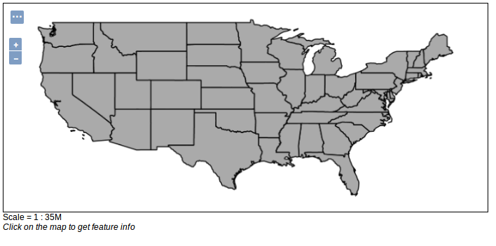

# Vector data sources

## Shapefile

The Shapefile Format, developed by the company *ESRI*, is the most widely used vector format in the GIS world.
Shapefiles (also called Shapes) are supported by both proprietary and OpenSource desktop GIS and are thus industry standard.

**Task:**

1. Create a new data store, which can be used to publish a Shapefile via GeoServer. Choose `us_states`
as name and use *states.shp* from the directory `data_dir/data/shapefiles`.

2. Publish your shapefile via GeoServer. This requires information on the spatial reference system (SRS) in which GeoServer should publish the geodata. Enter `EPSG:4326` into the field *Declared SRS*, so the layer is published in the WGS 84 reference system. The BoundingBox must also be specified. It can be calculated automatically by clicking on **Compute from data** and **Compute from native bounds**.

3. Open the newly created layer. Choose OpenLayers as Format for the preview and see your result.

## PostGIS

PostGIS is a spatial extension for the popular object-relational open source database system PostgreSQL.
The extension makes it possible to query spatial data via SQL and moreover offers a variety of options for processing geodata.
On OSGeoLive the database system is already installed and set up with a test database.

**Task:**

1. Create a new data store, which can be used to publish a PostgreSQL/PostGIS table. Choose the following connection settings:

  * host: <code>localhost</code>
  * port: <code>5432</code>
  * database: <code>natural_earth2</code>
  * schema: <code>public</code>
  * user: <code>user</code>
  * passwd: <code>user</code>

  Now you have successfully established a connection to a PostGIS database which contains geodata from the *Natural Earth* dataset.

2. Publish a table of your choice via GeoServer! Please enter SRS `EPSG:54009` as Standard.

3. Open the newly created layer in the layer preview!

## WFS

GeoServer also offers the possibility to use remote web services as a source for data storage.
A WFS (Web Feature Service) offers internet-based access to vector data. In addition to *Basis WFS*, which provides read-only access, *Transaction WFS* also provides written access.

**Task:**

1. Add a new store, which can be used to publish an already existing WFS cascaded via GeoServer. Use for example
the following service: https://www.wfs.nrw.de/geobasis/wfs_nw_dvg?SERVICE=WFS&VERSION=2.0.0&REQUEST=GetCapabilities

2. Publish a service of your choice via GeoServer!

3. Open the newly created layer in the layer preview.

4. If the display does not work with OpenLayers, check the settings of the layer in the tab `Publishing`.
GeoServer is not always able to recognize the appropriate style for the geodata automatically.  If the *Default Style*
is set to *generic*, change it to *Polygon*, *Point* or *Line* (depending on the type of geodata of the WFS).
