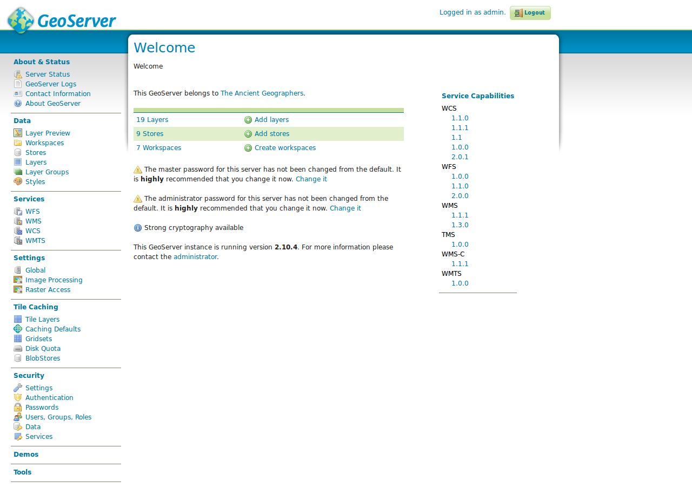
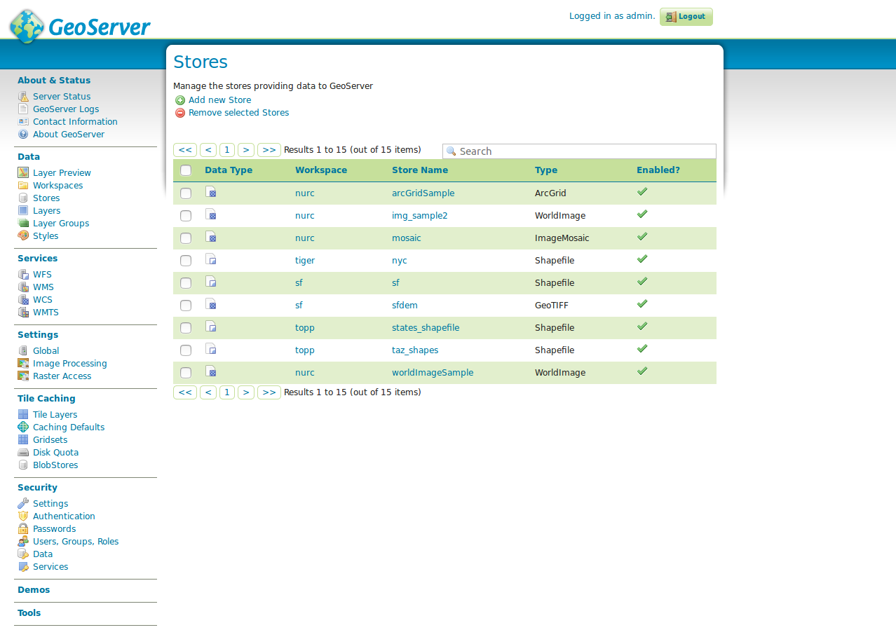
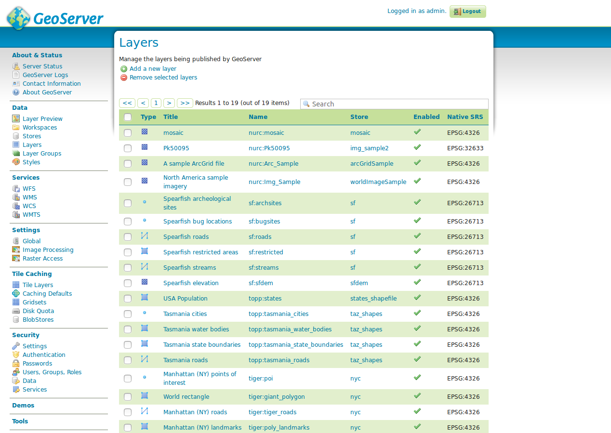
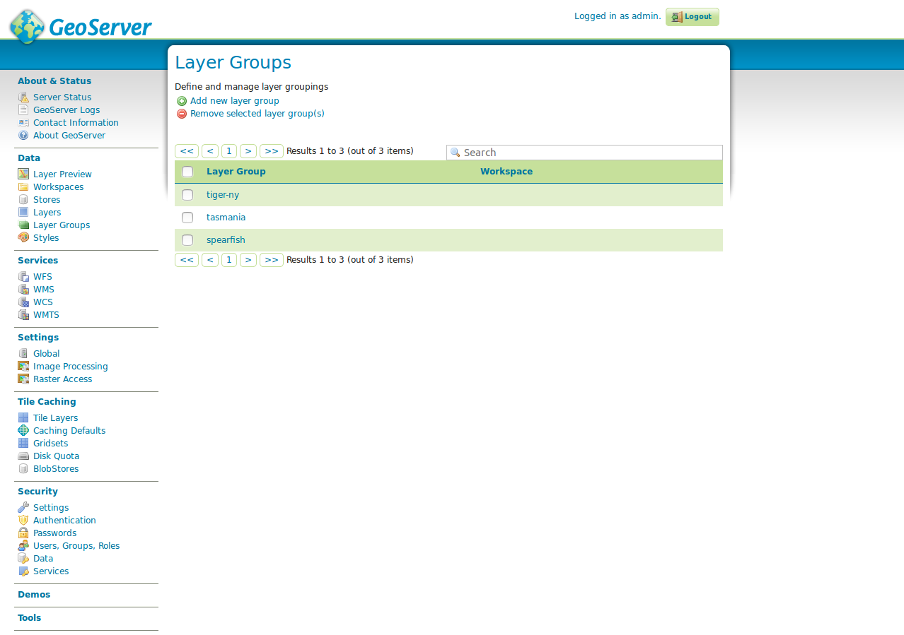
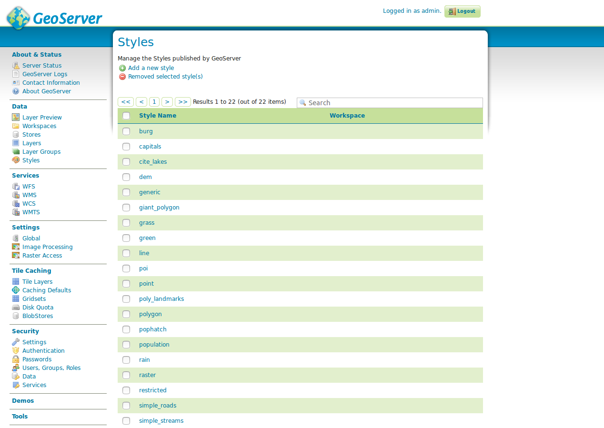

# Administrationsoberfläche

## Anmelden

Öffnen Sie, sofern noch nicht geschehen, die Startseite der GeoServers Weboberfläche
in einem Browser Ihrer Wahl über die folgende URL:

{{ book.geoServerBaseUrl }}

Melden Sie sich im oberen Bereich mit den folgenden Anmeldedaten ein:

* Benutzer: <code>{{ book.geoServerUser }}</code>
* Passwort: <code>{{ book.geoServerPassword }}</code>

Mit erfolgreicher Anmeldung (als Administrator) wurde der Zugang zu allen
Funktionen des Kartenservers freigeschaltet und der Startbildschirm ändert sich
einer Ansicht ähnlich der folgenden Abbildung.



## Übersicht der Funktionselemente

Die Oberfläche des GeoServers ist in zwei Bereiche aufgeteilt:
Links das Navigationsmenü, in dem sortiert nach Subkategorie alle Einstellungsmöglichkeiten
und Listen erscheinen. Im zentralen Bereich erscheinen je nach Auswahl der Kategorie die zugehörigen
Formularfelder. Je nach Auswahl können diese Formulare in mehrere Reiter unterteilt
sein. Im Folgendem werden nun die wichtigsten Subkategorien und Anwendungsfälle aufgeführt und erläutert.

### Server

#### Serverstatus


Unter **Serverstatus** befinden sich Angaben zum aktuellen Zustand des Kartenservers.
Hierzu gehören neben diversen Systemangaben (z.B. verfügbare
Schriftarten, verwendete Java-Version oder aktuell verwendetem Arbeitsspeicher)
Installationsspezifika wie das aktuell genutzte Datenverzeichnis. Die Statusseite
ist die erste Anlaufstelle, falls die Performance eines Layers nicht der üblichen
Geschwindigkeit entspricht oder Änderungen auf Dateiebene des GeoServers vorgenommen
wurden (z.B. Installation neuer Schriftarten, Änderungen in Konfigurationsdateien).
Zwar sind Änderungen auf Dateiebene nicht zu empfehlen, lassen sich jedoch ggf.
nicht verhindern, wenn z.B. die Konfiguration eines anderen GeoServers übernommen
werden soll. In diesem Fall muss die Konfiguration über den Button **Neu laden**
unter **Konfiguration und Katalog** betätigt werden. Reagiert die Benutzeroberfläche
sehr träge oder erscheinen Layer nur sehr langsam in der Applikation kann es oft
hilfreich sein, den Ressourcen Cache über den Button **Leeren** und/oder den verwendeten
Arbeitsspeicher über **Arbeitsspeicher freigeben** freizugeben.

#### Protokollierung


Bei jeglichen Fehlern, die sich eindeutig dem GeoServer zuordnen lassen (wie z.B.
keine oder eine falsche Antwort eines Kartendienstes) ist das Protokoll die erste
Anlaufstelle. Das GeoServer Protokoll lässt sich dabei entweder direkt über die
GUI (s. obige Abbildung) oder direkt vom Dateisystem ({{ book.geoServerPhysicalPath }}/logs/geoserver.log)
aufrufen. Ist die Fehlerausgabe zu kurz, kann die Länge der Ausgabe über das Feld
Maximale Anzahl von Zeilen in der Konsole gesteuert werden. Die Fehlerausgabe von
Java/vom GeoServer ist in aller Regel sehr ausführlich, sodass die Fehler verursachende
Komponente schnell ausfindig gemacht werden kann. Schwerwiegende Fehler werden
dabei meist mit dem Kürzel `ERROR` vorgestellt. Beispielsweise würde sich die Fehlerausgabe

```
2014-10-06 09:16:33,492 ERROR [geoserver.wms] - Getting feature source: featureType: GEOSERVER:EXAMPLE_LAYER does not have a properly configured datastore
```

beim Abrufen der Datenquelle für einen Layer auf einen unsauber konfigurierten
Datenspeicher zurückführen lassen. Dies kann entweder tatsächlich einer fehlerhaften
Konfiguration oder z.B. einem Ausfall der Quelldatenbank geschuldet sein.

**Hinweis:** Es existieren mehrere Protokollmodi, die eine unterschiedlich empfindliche
Ausgabe erzeugen. Nähere Informationen hierzu s. Kap. 6.2.1.13.

#### Kontaktangaben


Die obige Abbildung zeigt die Möglichkeiten zur Angabe von Kontaktdaten im GeoServer,
die in erster Linie für die Kartendienste des Servers relevant sind,
da diese im GetCapabilities Dokument erscheinen.

**Aufgabe:**

1. Rufen Sie das `GetCapabilities` Dokument des GeoServers auf. Klicken Sie hierzu auf der Startsteite rechts unter `Service Capabilities` auf WMS -> 1.3.0.
Bitte geben Sie nun unter `Contact information` Ihre Kontaktinformationen an. Rufen Sie anschließend nochmals das `GetCapabilities` auf. Was fällt Ihnen auf?

### Daten

Die folgenden Abschnitte beschreiben den umfangreichsten Konfigurationsbereich
des GeoServers, die Schritte zur Veröffentlichung eines Dienstes.

#### Layervorschau


Die **Layer-Vorschau** bietet eine Übersicht aller über diesen GeoServer veröffentlichten
Layer. Damit ein Layer in dieser Übersicht erscheint (und auch im GetCapabilities
Dokument der Instanz erscheint), muss der Layer als `Angekündigt` (s. Kap. 6.2.1.7)
gekennzeichnet sein.
Jeder Layer verfügt über eine Angabe des Typs (s. Tab. 2), einen internen Layernamen
(inklusive Name des Arbeitsbereichs), einen Layertitel (Kurzbeschreibung) und eine
Auswahlbox von möglichen Vorschauformaten.

| Typ | Beschreibung |
|:---:|--------------|
|  | Vektorlayer (Typ unbekannt) |
|  | Vektorlayer ((Multi-)Punkt) |
|  | Vektorlayer ((Multi-)Linie) |
|  | Vektorlayer ((Multi-)Polygon) |
|  | Rasterlayer |
|  | Gruppenlayer |
|  | Kaskadierter WMS |

Die Layerliste kann per Linksklick auf die Spaltennamen `Typ`, `Name`
oder `Titel` auf- und absteigend sortiert werden. Neben einer Übersicht aller
verfügbaren Layer, kann eine Vorschau eines Layers in verschiedenen Formaten
vorgenommen werden. Dies empfiehlt sich insbesondere für eine schnelle und
komfortable Überprüfung eines neu angelegten Layers. Der schnellste Weg zu einer
Vorschau ist das „Format“ OpenLayers, wodurch ein neues Fenster mit einer
Vorschaukarte des ausgewählten Layers geöffnet wird.


Die OpenLayers Map erlaubt eine freie Navigation innerhalb des Layers und eine
GetFeatureInfo-Abfrage durch einen Linksklick in den Layer. Über den Button
**toggle options toolbar** oberhalb des Navigationskreuzes kann eine
Werkzeugleiste eingeblendet werden, die Optionen zur Manipulation des GetMap-Aufrufs
ermöglicht (Bildformat und -größe, Antialiasing etc.).
Unter der Auswahlbox **Alle Formate** sind weitere Formate aufgelistet, die nach WMS
und WFS gegliedert sind. Für die Vorschau eines WMS wird dabei jedoch das obige
Format „OpenLayers“, für die Vorschau eines WFS das Format „GML2“ empfohlen.   
**Hinweis:** Über die Auswahlbox ist auch der Export als Shapefile möglich, das
in jedes gängige Desktop GIS zur Weiterverarbeitung eingebunden werden kann.

**Aufgabe:**

2. Rufen Sie die OpenLayers Layervorschau eines beliebigen Layers auf und ändern Sie die
Requestparamter `Tiling` und `Format` zu einem Parameter Ihrer Wahl. Rufen Sie anschließend
die GetFeatureInfo ab.

#### Arbeitsbereiche

Über den Menüeintrag **Arbeitsbereiche** kann die Übersicht aller verfügbaren Arbeitsbereiche
des GeoServers aufgerufen werden. Über die GUI können neue Arbeitsbereiche erstellt oder
bestehende editiert werden.


Der GeoServer legt Layer über folgende Hierarchie ab:

```
Arbeitsbereich
 └ Datenspeicher
  └ Layer
 └ Gruppenlayer
 └ Stile
```

Zentrales Element ist der sog. Arbeitsbereich, der zunächst als Sammelobjekt für
Layer verstanden werden kann. Analog zu einem Namensbereich organisiert der
Arbeitsbereich Objekte eines gemeinsamen Themas, z.B. die Layer einer bestimmten
Abteilung oder eines bestimmten Themas.
Jedem Arbeitsbereich können nun weitere Konfigurationselemente zugeordnet werden.
Hierzu zählen u.a. der Datenspeicher, die (Gruppen-) Layer, Stile und übergeordnete
Einstellungen des GeoServers wie Kontaktdaten oder globale WMS-Einstellungen.
**Wichtig:** Wird ein GeoServer initial in Betrieb genommen, muss die oben
skizzierte Reihenfolge beim Anlegen eines Layers genauestens beachtet werden, d.h. zunächst
wird ein Arbeitsbereich, danach ein Datenspeicher und anschließend ein Layer
(inklusive Stil) angelegt.

**Hinweis:** Der GeoServer besitzt im Auslieferungszustand mehrere Beispiel-Arbeitsbereiche
(*cite, it.geosolutions, nurc, sde, sf, tiger, topp*). Diese können im
Produktivbetrieb ohne Bedenken gelöscht werden.

**Aufgabe:**

Legen Sie einen neuen Arbeitsbereich mit dem Namen `FOSSGIS` an. Als Namespace URI geben Sie
`http://geoserver.org/fossgis`. Markieren Sie diesen Arbeitsbereich als Standardarbeitsbereich.

#### Datenspeicher



Der **Datenspeicher** ist eine Referenz zu einer Datenquelle, die Vektor- oder Rasterdaten
zur Veröffentlichung enthält. Jeder Datenspeicher wird dabei genau einem Arbeitsbereich
zugeordnet. Ein Datenspeicher beinhaltet dabei z.B. Verbindungsparameter
zu einer Datenbank oder den Pfad zu einem Shapefile.
Die obige Abbildung zeigt die Übersicht aller verfügbaren Datenspeicher, die über
das Feld Datenspeicher im linken Navigationsmenü aufgerufen werden kann. Die
Übersicht besteht aus den Spalten *Datentyp, Arbeitsbereich, Name für Datenspeicher,
Typ* und *Aktiv*. Der Datentyp beschreibt den Typ des Datenspeichers, wobei es sich
um einen der in *Tab. 3* aufgelisteten Datentypen handeln kann. Arbeitsbereich
beinhaltet den übergeordneten Namen des Arbeitsbereichs, Name für Datenspeicher den
Namen des Datenspeichers, Typ den konkreten Speichertyp (z.B. die Datenbank) und
Aktiv den Status des Datenspeichers.

| Typ | Beschreibung |
|:---:|--------------|
|  | Einzeldatei/Verzeichnis (Vektordaten) |
|  | Einzeldatei/Verzeichnis (Rasterdaten) |
|  | Datenbank (Vektordaten) |
|  | WMS |
|  | WFS |

Über das Formular kann sowohl einer neuer Datenspeicher angelegt werden als auch
ein bestehender Datenspeicher editiert werden.

Hier keine Aufgabe, kommt später

#### Layer



Layer sind die Repräsentationen von Geodaten (Vektor- oder Raster). Jeder Layer
enthält dabei mehrere Kartenelemente (Features), die als gerenderte Rasterdaten
(WMS) oder als Rohdaten (WFS bzw. WCS) abgerufen werden können. Jedem Layer ist im GeoServer
gemein, dass sie genau einem Arbeitsbereich und genau einem Datenspeicher zugehörig
sind.
**Wichtiger Hinweis:** Der GeoServer legt automatisch für jeden Layer einen
WMS und WFS an, ein getrenntes Anlegen ist nicht möglich. Es ist ausschließlich
möglich im Arbeitsbereich zu definieren, ob alle Layer in diesem Arbeitsbereich
sowohl per WMS als auch per WFS, nur als WMS oder nur als WFS abfragbar sind.

Die Übersicht besitzt Spalten zur Angabe des jeweiligen Typs, dem Namen des
Arbeitsbereichs, Datenspeichers sowie des Layers (Name), Status (Aktiv) und
Koordinatenreferenzsystem im EPSG Code. Wie bei den anderen Listentypen auch,
kann die Liste nach den entsprechenden Spalten durch einen Linksklick auf den
Spaltentitel auf-  und abwärts sortiert werden. Über die Liste ist ebenfalls ein
direkter Aufruf der Parameter des Arbeitsbereichs sowie des Datenspeichers
durch einen Linksklick auf die entsprechenden Titel möglich.

Hier keine Aufgabe später

#### Gruppenlayer



Gruppenlayer sind eine Sammlung von bereits im GeoServer veröffentlichten Layern,
die gemeinsam über nur einen Layer angefordert werden.

Für das Anlegen eines Gruppenlayers über das Formular **Gruppenlayer hinzufügen** sind mindestens
die folgenden Einstellungen notwendig:

* `Name`: Name des Layers.
* `Titel`: Titel des Layers.
* `Arbeitsbereich`: Der Name des Arbeitsbereichs, in dem der Gruppenlayer angelegt
  werden soll.
* `Ausdehnung`: Die vier Felder (Min X, Min Y, Max X, Max Y) beinhalten die BoundingBox
  der Daten dieses Gruppenlayers im nativen Koordinatenreferenzsystem. Die Eingabe
  kann manuell oder automatisch über **Ausdehnung generieren** (empfohlen) erfolgen.
  **Wichtig:** Ohne Angabe einer BoundingBox kann der Layer nicht erfolgreich angelegt
  werden und die Werte sollten immer den kompletten Datenbestand beinhalten, da
  diese über den GetCapabilities-Request abgefragt und beim Einladen eines WMS
  (z.B. mit QGIS) relevant für den initialen Kartenausschnitt sind.
* `Koordinatenreferenzsystem`: Koordinatenreferenzsystem im EPSG-Code.
* `Layer`: Über den Button **Layer hinzufügen** oder **Layergruppe hinzufügen** können dem
  Gruppenlayer einzelne Layer oder andere Gruppenlayer hinzugefügt werden.
  Durch einen Klick auf den entsprechenden Button öffnet sich das Fenster Layer
  auswählen, in dem alle verfügbaren Layer der GeoServer Instanz erscheinen.
  Aus dem Fenster kann ein Layer durch einen Klick auf den Layernamen ausgewählt
  und an den Gruppenlayer übergeben werden. Jeder ausgewählte Layer erscheint
  anschließend in der Tabelle unterhalb des Formularelements Layer.

In der Übersichtstabelle kann die Zeichenreihenfolge der Layer durch die Pfeilsymbole angegeben
werden, wobei der oberste Layer als unterster Layer in diesem Gruppenlayer gezeichnet
wird. Weiter kann dem Layer ein Stil abweichend vom Layer zugewiesen oder der
Layer aus der Gruppe entfernt werden.

Hier keine Aufgabe später

#### Layerstile



Die Zeichenvorschrift bestimmt das Aussehen eines Layers in Abhängigkeit von
Attributeigenschaften. Im GeoServer wird die Symbologie eines Layers über ein SLD
(Styles Layer Descriptor, ein XML-Dialekt) angeben, welches im Dialog Stile
erstellt bzw. geändert werden kann.

Die Liste enthält alle verfügbaren Stile dieses GeoServers und erlaubt entweder
das Erstellen eines neuen Stils durch den Button Hinzufügen eines neuen Stils,
das Entfernen eines bestehenden Stils (Auswahl des Stils über die Checkbox und
Klick auf Ausgewählte Stile löschen) oder das Ändern eines bestehenden Stils
durch einen Klick auf den Stilnamen.

Wird ein neuer Stil erstellt oder ein bestehender Stil editiert, öffnet sich das
Formular Neuer Stil bzw. Stil Editor. Das Formular bietet folgende Optionen:

* `Name`: Name des Stils. Ist der Stil genau von einem Layer in Verwendung, sollte der
  Name dies widerspiegeln (gleicher Name wieder Layer o.ä.).
* `Arbeitsbereich`: Arbeitsbereich dieses Stils.
* `Von einem vorhandenen Stil kopieren`: Sind Elemente des neuen Stils bereits in
  einem bestehende Stil vorhanden, kann ein vorhandener Stil als Vorlage für den
  neuen Stil ausgewählt werden.
* `SLD Eingabefeld`: Im Eingabefeld erfolgt die Eingabe des Layerstils. Eine vollständige
  Erläuterung der SLD-Syntax würde den Rahmen dieses Workshops sprengen, daher wird
  an dieser Stelle auf die GeoServer Dokumentation, gegliedert nach Einsatzzwecken, verwiesen:
    * Inhaltsverzeichnis: http://docs.geoserver.org/latest/en/user/styling/index.html
    * Punktstile: http://docs.geoserver.org/latest/en/user/styling/sld-cookbook/points.html
    * Linienstile: http://docs.geoserver.org/latest/en/user/styling/sld-cookbook/lines.html
    * Polygonstile: http://docs.geoserver.org/latest/en/user/styling/sld-cookbook/polygons.html
* `Datei auswählen`: Wurde das SLD in einem externen Editor erstellt, kann diese Datei
   direkt in das Formular geladen werden.

Wichtiger Hinweis: Bevor der Stil über Speichern gespeichert wird, sollte dieser über
Validieren auf Korrektheit geprüft werden. Liegt ein Fehler (z.B. in der Syntax)
vor, erscheint am oberen Rand des Formulars ein Fehler mit einem Hinweis auf die
Fehlerursache.

Hier keine Aufgabe später

### Services

#### WFS

Das Formular Web Feature Service beinhaltet globale Einstellungen zu allen WFS
des ausgewählten Arbeitsbereichs.

* `Service Metadaten`: Die Angaben im Bereich Service Metadaten sind relevant für die
  Capabilities des Kartenservers und sind an die gegebenen Umstände anzupassen
  (Ist z.B. eine Zugriffsbeschränkung der Dienste vorhanden?, Welche Schlüsselworte sind vergeben?).
  Für eine Übersicht aller Felder siehe auch http://docs.geoserver.org/latest/en/user/webadmin/services/WCS.html#service-metadata.
  Wichtiger Hinweis: Ist die Checkbox WFS aktiv nicht bestätigt, sind keine WFS Abfragen möglich.
* `Max. Anzahl von Features`: Soll die maximale Anzahl der über ein WFS GetFeature
  Request ausgegeben Features begrenzt werden, kann diese Anzahl in dem Feld erfolgen.
* `Dienstgüte`: Der GeoServers implementiert eine voll transaktionale WFS Schnittstelle
  (WFS-T). Dies bedeutet, dass über den GeoServer Features sowohl abgerufen
  (WFS GetFeature) als auch editiert (CREATE, UPDATE, DELETE) werden können (WFS Transaction).
  Die Checkboxen unter Dienstgüte stehen für:
    * `Basis`: Features können über die WFS Schnittstelle ausschließlich abgefragt werden
      (GetCapabilities, DescribeFeatureType, GetFeature Operationen möglich).
    * `Transaktional`: Features können über die WFS Schnittstelle erstellt, geändert und
      gelöscht werden (zusätzlich zu Basis ist die Operation Transaction möglich).
    * `Vollständig`: Neben den transaktionen Schnittstellen ist die LockFeature (Sperren
      eines Features bei Bearbeitung ohne das eine weitere Operation das Feature ändert) Operation erlaubt.

#### WMS

Das Formular Web Map Service beinhaltet globale Einstellungen zu allen WMS des
ausgewählten Arbeitsbereichs.

* `Service Metadaten`: Die Angaben im Bereich Service Metadaten sind relevant für die
  Capabilities des Kartenservers und sind an die gegebenen Umstände anzupassen
  (Ist z.B. eine Zugriffsbeschränkung der Dienste vorhanden?, Welche Schlüsselworte
  sind vergeben?). Für eine Übersicht aller Felder siehe auch http://docs.geoserver.org/latest/en/user/webadmin/services/WCS.html#service-metadata.
  Wichtiger Hinweis: Ist die Checkbox WMS aktiv nicht bestätigt, sind keine WMS
  Abfragen möglich.
* `Eingeschränkte Liste der Koordinatenreferenzsysteme`: Per Default ist es möglich,
  WMS- und WFS Dienste in allen dem GeoServer zur Verfügung stehenden
  Koordinatenreferenzsystemen abzufragen. Soll die Verfügbarkeit eingeschränkt werden,
  wird eine Komma separierte Liste der EPSG-Coes in der Liste angegeben (z.B. 4326, 25833).
  Um eine maximale Kompatibilität der Dienste zu gewährleisten, empfiehlt es sich
  jedoch, alle verfügbaren Systeme anzubieten.
* `Raster Rendering Optionen`: Der GeoServer erlaubt die Auswahl von drei Rendering
  Methoden beim Zeichnen eines WMS, die sich in dem Einbezug benachbarter Zellen
  bei der Berechnung des Zellenwerts eines Rasterbildes äußern: Nächster Nachbar,
  Bilinear und Bicubic. Für einen optimale Performance sollte der Standardwert
  von Nächster Nachbar nicht geändert werden. Siehe auch: http://docs.geoserver.org/stable/en/user/webadmin/services/WMS.html#raster-rendering-options.
* `Wasserzeichen Einstellungen`: Über ein Wasserzeichen kann z.B. ein
  Copyright-Hinweis in jedes Kartenbild gezeichnet werden. Soll ein Wasserzeichen
  eingebunden werden, muss die Checkbox Aktiviere Wasserzeichen sowie ein
  entsprechende Grafikdatei ausgewählt werden. Wichtiger Hinweis: Wird ein
  Wasserzeichen in die Kartenkachel gezeichnet, erscheint diese in jeder Kachel.
  Dies resultiert bei einer Kachelung des Dienstes, d.h. der Zerlegung des angeforderten
  Kartenausschnitts in gleich große Kacheln, in eine mehrfache Aufführung des
  Wasserzeichens im aufrufenden Client.
* `PNG/JPEG Optionen`: Um den HTTP-Traffic zu minimieren, ist es möglich die Kartenkacheln
  im Ausgabeformat PNG oder JPEG zu komprimieren. Die Kompression wird über einen
  Ganzzahlenwert zwischen 0 und 100 angegeben (0 = keine Kompression, 100 = maximale Kompression).
  Der Standardwert von 25 stellt hierbei einen guten Kompromiss dar.

### Einstellungen

#### Global

Unter dem Dialog **Globale Einstellungen** finden sich folgende relevante
Konfigurationsmöglichkeiten, die unter Umständen für Entwicklungs- oder
Produktionsbetrieb angepasst werden sollten:

* `Ausführliche Meldungen`: Ist die Checkbox gesetzt, sind die XML-Antworten des
  GeoServers möglichst lesbar (durch Leerzeichen, Zeilenumbrüche etc.). Da hierdurch
  größere Dateien verursacht werden, ist diese Einstellung nur für den Testbetrieb
  ratsam.
* `Ausführliche Fehlerausgaben`: Ist die Checkbox gesetzt, wird das volle Java Stacktrace
  in die Log-Datei geschrieben. Da hierdurch eine größere Log-Dateien verursacht werden,
  ist diese Einstellung nur für das Debuggen ratsam.
* `Zeichensatz`: Welche Zeichenkodierung soll der GeoServer verwenden? Der Standardwert von
  UTF-8 sollte nicht geändert werden, um Kodierungsfehler in den Antworten des
  GeoServers zu vermeiden.
* `Proxy URL`: Ist der GeoServer über einen reverse-proxy (http://httpd.apache.org/docs/2.2/mod/mod_proxy.html)
  erreichbar gemacht worden, kann in diesem Feld die Adresse des Proxy eingetragen werden.
  Im Normalfall ist dieses Feld auf einen leeren String zu setzen.
* `Profil für die Protokollierung`: Der GeoServer besitzt per default fünf Protokollprofile,
  die eine unterschiedliche Sensitivität der Log-Ausgabe besitzen. Die Wahl ist
  immer abhängig von der Umgebung (Entwicklung oder Produktion):
    * `DEFAULT_LOGGING`: Mittleres Protokolllevel auf fast allen Modulebenen des GeoServers.
    * `GEOSERVER_DEVELOPER_LOGGING`: Ausführliche Protokollierung auf Ebene des
      Moduls GeoServer. Nur sinnvoll, wenn der GeoServer debuggt wird.
    * `GEOTOOLS_DEVELOPER_LOGGING`: Ausführliche Protokollierung auf Ebene des
      Moduls GeoTools. Diese Auswahl kann nützlich sein, wenn überprüft werden
      soll, welche SQL Statements (z.B. bei einer GetFeature Abfrage) an die
      Datenbank gesendet werden.
    * `PRODUCTION_LOGGING`: Minimale Protokollierung, nur Fehler werden ausgegeben.
      Diese Einstellung ist für den Produktiveinsatz zu wählen.
    * `VERBOSE_LOGGING`: Ausführliche Protokollierung auf allen Ebenen des GeoServes.
      Nur sinnvoll, wenn der GeoServer debuggt wird.
* `Speicherort für Protkolldatei`: Angabe des Speicherorts für die Logging-Dateien
relativ zum GeoServer data-Verzeichnis (meist /usr/share/tomcat7/webapps/geoserver/data/).
Der Pfad ist in aller Regel auf dem Standard von logs/geoserver.log zu belassen.

### Sicherheit

**Aufgabe:**

Bitte ändern Sie das Standard-Passwort für den Benutzer `admin` von `geoserver` zu `fossgis`.
