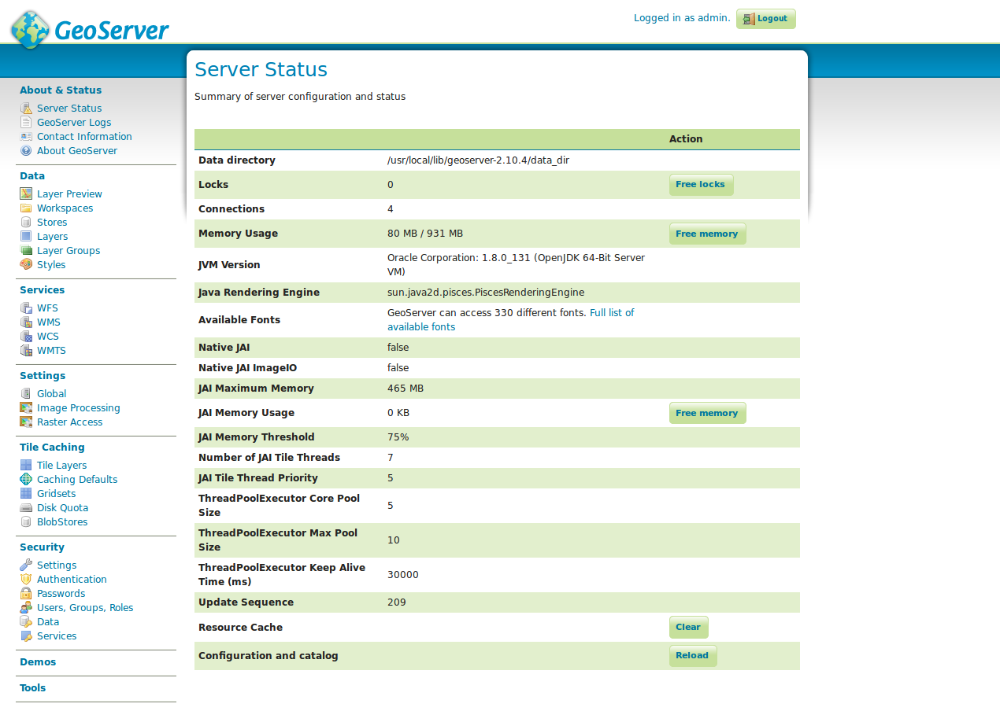
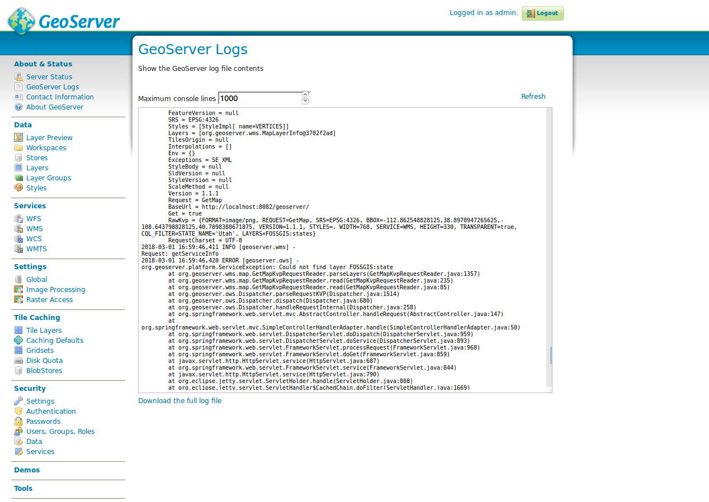

### Server

#### Serverstatus



Unter **Serverstatus** befinden sich Angaben zum aktuellen Zustand des Kartenservers.
Hierzu gehören neben diversen Systemangaben (z.B. verfügbare
Schriftarten, verwendete Java-Version oder aktuell verwendetem Arbeitsspeicher)
Installationsspezifika wie das aktuell genutzte Datenverzeichnis. Die Statusseite
ist die erste Anlaufstelle, falls die Performance eines Layers nicht der üblichen
Geschwindigkeit entspricht oder Änderungen auf Dateiebene des GeoServers vorgenommen
wurden (z.B. Installation neuer Schriftarten, Änderungen in Konfigurationsdateien).
Zwar sind Änderungen auf Dateiebene nicht zu empfehlen, lassen sich jedoch ggf.
nicht verhindern, wenn z.B. die Konfiguration eines anderen GeoServers übernommen
werden soll. In diesem Fall muss die Konfiguration über den Button **Neu laden**
unter **Konfiguration und Katalog** betätigt werden. Reagiert die Benutzeroberfläche
sehr träge oder erscheinen Layer nur sehr langsam in der Applikation kann es oft
hilfreich sein, den Ressourcen Cache über den Button **Leeren** und/oder den verwendeten
Arbeitsspeicher über **Arbeitsspeicher freigeben** freizugeben.

#### Protokollierung



Bei jeglichen Fehlern, die sich eindeutig dem GeoServer zuordnen lassen (wie z.B.
keine oder eine falsche Antwort eines Kartendienstes) ist das Protokoll die erste
Anlaufstelle. Das GeoServer Protokoll lässt sich dabei entweder direkt über die
GUI (s. obige Abbildung) oder direkt vom Dateisystem ({{ book.geoServerPhysicalPath }}/logs/geoserver.log)
aufrufen. Ist die Fehlerausgabe zu kurz, kann die Länge der Ausgabe über das Feld
Maximale Anzahl von Zeilen in der Konsole gesteuert werden. Die Fehlerausgabe von
Java/vom GeoServer ist in aller Regel sehr ausführlich, sodass die Fehler verursachende
Komponente schnell ausfindig gemacht werden kann. Schwerwiegende Fehler werden
dabei meist mit dem Kürzel `ERROR` vorgestellt. Beispielsweise würde sich die Fehlerausgabe

```
2014-10-06 09:16:33,492 ERROR [geoserver.wms] - Getting feature source: featureType: GEOSERVER:EXAMPLE_LAYER does not have a properly configured datastore
```

beim Abrufen der Datenquelle für einen Layer auf einen unsauber konfigurierten
Datenspeicher zurückführen lassen. Dies kann entweder tatsächlich einer fehlerhaften
Konfiguration oder z.B. einem Ausfall der Quelldatenbank geschuldet sein.

**Hinweis:** Es existieren mehrere Protokollmodi, die eine unterschiedlich empfindliche
Ausgabe erzeugen. Nähere Informationen hierzu s. Kap. 6.2.1.13.

#### Kontaktangaben


Die obige Abbildung zeigt die Möglichkeiten zur Angabe von Kontaktdaten im GeoServer,
die in erster Linie für die Kartendienste des Servers relevant sind,
da diese im GetCapabilities Dokument erscheinen.

**Aufgabe:**

1. Rufen Sie das `GetCapabilities` Dokument des GeoServers auf. Klicken Sie hierzu auf der Startsteite rechts unter `Service Capabilities` auf WMS -> 1.3.0.
Bitte geben Sie nun unter `Contact information` Ihre Kontaktinformationen an. Rufen Sie anschließend nochmals das `GetCapabilities` auf. Was fällt Ihnen auf?
